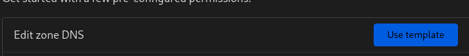

# VPS Server
## VPS Initial Setup
### Creating an OpenSSH Key Pair with ssh-keygen
1. In the terminal enter `ssh-keygen -t rsa -N "" -b 2048 -C "<key_comment>"` 
    - **-t rsa**: Use RSA algorithm
    - **-N ""**: A passphrase to protect the use of the key (like a password). A blank value means no passphrase is set
    - **-b 2048**: Generate a 2048-bit key. A minimum of 2048 bits is recommended for SSH-2 RSA
    - **-C "<key-comment>"**: A text coment that is placed in the public key file
    - (optional) **-f <path/key_nam>**: The location where the key pair will be saved and the key name for the files
1. Use `cat <key-name>.pub | wl-copy` to copy public key contents into your system clipboard

### Accessing VPS via SSH
- use `ssh root@<ip>` to ssh into a remote machine

### Creating a User
- as root use `adduser <name>` command to create a new user
- as root use `usermod -aG sudo <name>` to grant sudo permissions to the user 
- use `su - <name>` to switch to the new user

### Pointing a Domain Name to the VPS
- delete the A and CNAME records, they are no longer needed
- add a new record for the root domain pointing to the IP of the VPS
    - **type**: A
    - **name**: @
    - **points to**: <ip>
    - **TTL**: 14400
- use `ip addr` to grab the ip on the server
- use `dnslookup <domain_name>` to confirm the domain is pointing to the VPS

## SSH Hardening
### Disable Password Authentication on SSH
- use `ssh-copy-id -i <key-name>.pub <user>@<ip>` from your local machine to copy the public ssh to the remote user 
- on the VPS open **/etc/ssh/sshd_config** 
    - set *PasswordAuthentication* to *no*
    - set *PermitRootLogin* to *no* 
    - set *UsePAM* to *no*
- Hostinger has **/etc/ssh/sshd_config.d/50-cloud-init.conf** 
    - set *PasswordAuthentication* to *no*
- use `sudo systemctl reload ssh` to apply these changes

## Running the Application
### Docker Initial Setup
- install docker and docker-compose-plugin
- if docker isn't running use `sudo systemctl enable docker` to enable it
- use `sudo usermod -aG docker <user>` to add the user to the docker group so **sudo** isn't needed to run docker commands

### Docker Context
- use `docker context create <context-name> --docker "host=ssh://<user>@<ip>"` to create a docker context of the vps
- from your local context use `docker build . --tag '<namespace>/<repo>'` to build the image locally
- from your local context use `docker push <image-name>:<tag>` to push an image to a docker hub repo
- use `docker context use <context-name>` to switch context

### Docker Stack
- from the vps context use `docker stack deploy -c compose.yml <service-name>` to deploy multiple containers
- use `docker service logs <sub-service-name>` to see its logs

## Firewall Setup
### Uncomplicated Firewall (UFW)
- use `sudo ufw default deny incoming` to disable all incoming network requests by default
- use `sudo ufw default allow outgoing` to enable all outgoing requests by default
- use `sudo ufw allow OpenSSH` to allow connections to the OpenSSH server
- use `sudo ufw allow <port>` to allow connetions over that port
- use `sudo ufw show added` to confirm that you have configured the firewall correctly
- use `sudo ufw enable` to enable firewall rules
- use `sudo ufw status` to check firewall status

> [!NOTE]
> Exposing a port with **docker** will override the ip tables rules defined by **ufw**
> *This can be resolved by setting up reverse proxy*

## Reverse Proxy Setup
> [source](https://www.youtube.com/watch?v=-hfejNXqOzA&t=1718s)
### Traefik Setup
- create a project with a compose.yml with traefik boilerplate
```yml
services:
    traefik: 
        image: traefik:v3.1
        command:
          - "--providers.docker"
          - "--providers.docker.exposedByDefault=false"
          - "--log.level=DEBUG"
          - "--entryPoints.web.address=:80"
          - "--entryPoints.websecure.address=:443"
        ports:
            # HTTP port
            - "80:80"
            # HTTPS port
            - "443:443"
        volumes:
            # So that Traefik can listen to Docker events
            - /var/run/docker.sock:/var/run/docker.sock
```
### (Optional) Custom Network Setup
- from the VPS use `docker network create <name>` to create a new network for the reverse proxy to run on
- use `docker network ls` to confirm the docker network has been created
- add the name of the custom network to the **networks** section of the compose.yml file
- set *external* to *true* to prevent docker compose from creating this network and instead search for it externally
```yml
networks:
    proxy:
        external: true
```
- attach the container to this custom network
```yml
    networks:
        - proxy
```

### Container Routing
- add the following to the compose.yml of the application to be routed
```yml
    labels:
        - traefik.enable=true
        - traefik.http.routers.myrouter.rule=Host(`<domain>`)
        - traefik.http.routers.myrouter.entrypoints=web
```

## HTTPS Setup
- in cloudflare create an API token using the **Edit zone DNS** template

- set the created token as an environment variable within the reverse-proxy project
```env
CF_DNS_API_TOKEN = '<token>'
```
```yml
    environment:
        - CF_DNS_API_TOKEN=${CF_DNS_API_TOKEN}
```
- in  traefik create the following certificate resolver
```yml
    commands:
      - "--certificatesresolvers.cloudflare.acme.email=<email>"
      - "--certificatesresolvers.cloudflare.acme.storage=/letsencrypt/cloudflare-acme.json"
      - "--certificatesresolvers.cloudflare.acme.caserver=https://acme-v02.api.letsencrypt.org/directory"
      - "--certificatesresolvers.cloudflare.acme.keytype=EC256"
      - "--certificatesresolvers.cloudflare.acme.dnschallenge=true"
      - "--certificatesresolvers.cloudflare.acme.dnschallenge.provider=cloudflare"
      - "--certificatesresolvers.cloudflare.acme.dnschallenge.resolvers=1.1.1.1:53,8.8.8.8:53"
```
- create a volume to store the certs in the reverse-proxy project compose.yml
```yml
    volumes:
        - letsencrypt:/letsencrypt
volumes:
    letsencrypt:
```
- in the web appication compose.yml add the following *labels*
```yml
    labels:
        - traefik.http.routers.mytlsrouter.tls=true
        # this will match the cert resolver configured in traefik
        - traefik.http.routers.mytlsrouter.tls.certresolver=cloudflare
        - traefik.http.routers.mytlsrouter.rule=Host(`<domain>`)
        - traefik.http.routers.mytlsrouter.entrypoints=websecure
```
- modify the **web** *entryPoint* in the traefik config to redirect all HTTP trafic to HTTPS
```yml
    commands:
      - "--entryPoints.web.http.redirections.entryPoint.to=websecure"
      - "--entryPoints.web.http.redirections.entryPoint.scheme=https"
      - "--entryPoints.web.http.redirections.entryPoint.permanent=true"
```

## Automated Deployments
- add the following github workflow to your application
```yml
name: deploy
on:
    push:
        branches:
            - "main"
permissions:
    packages: write
jobs:
    build-and-push-iamge:
        runs-on: ubuntu-latest
        steps:
        - name: Checkout repository
          uses: actions/checkout@v4
        - name: Log in to the container registry
          uses: docker/login-action@v3
          with:
            registry: https://ghcr.io
            username: ${{ github.actor }}
            password: ${{ secrets.GITHUB_TOKEN }}
        - name: Build and push Docker image
          uses: docker/build-push-action@v6
          with:
            context: .
            push: true
            tags: |
                ghcr.io/<gh-username>/<repo>:latest
                ghcr.io/<gh-username>/<repo>:${{ github.sha }}
    deploy:
        runs-on: ubuntu-latest
        needs:
            - build-and-push-image
        steps:
        - name: Checkout Code
          uses: actions/checkout@v2
        - name: Create Env File
          run: |
            echo "GIT_COMMIT_HASH=${{ github.sha }}" >> ./envfile
        - name: Docker Stack Deploy
          uses: cssnr/stack-deploy-action@v1
          with:
            name: <repo>
            file: docker-stack.yml
            host: <domain>
            user: <user>
            ssh_key: ${{ secrets.DEPLOY_SSH_PRIVATE_KEY }}
            env_file: ./envfile

```
- update your service to get the image from the tags created here
- this will get the *GIT_COMMIT_HASH* from the environment variable
```yml
    web:
        image: ghcr.io/<gh-username>/<repo>:${GIT_COMMIT_HASH:-latest}
```
### Create Deploy User
- from the VPS as *root* use `adduser deploy` to create a new user for deployments
- use `usermod -aG docker deploy` to add the new user to the docker group
- from local machine use `ssh-keygen -t ed25519 -C "deploy@<host>"` to create an ssh key pair for this user
- use `wl-copy < <ssh-key-name>.pub` to copy the public key to your clipboard
- from the VPS use `su - deploy` to switch to this user
- use `echo 'ssh-ed25519 <ssh-key> deploy@<host>' > .ssh/authorized_keys` to paste the key on the VPS
- use `ssh deploy@<host> -i <ssh-key-name>` to confirm you can ssh as the new user
- add the following text to the beginning of the **authorized_keys** file to limit the commands available to the user over ssh
```text
command="docker system dial-stdio"
```
> [!NOTE]
> this will remove the ability to ssh into the machine as this user

- navigate to *Settings > Secrets and variables > Actions* in the github repo
- click **New repository secret** and give it the same name as what's in the github workflow file
- use `wl-copy < <ssh-key-name>` to copy the private key to your clipboard

### Load Balancing
- use `docker service scale <service-name>=<num>` to scale up the number of replicas for that service
> [!NOTE]
> for this to work with Traefik's load balancing the following label will have to be added to the application compose.yml
> `traefik.http.services.<service-name>.loadbalancer.server.port=<port-application-listens-on>`

### Rollbacks
- use `docker service rollback <service-name>` to rollback to the previous docker image

