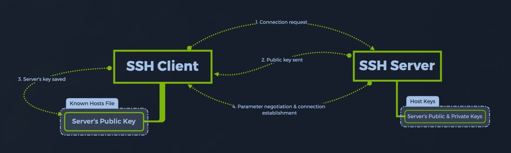

# Tools
- use [SpeedGuide](https://www.speedguide.net/port.php) for understanding basic information about a port

# Enumeration
- use `ping {TARGET_IP}` to test the connection to an IP
- use `nmap {TARGET_IP}` to quickly scan open ports
    - use `-p-` to can all TCP ports ranging from 0-65535
    - use `-sV` to determine the version of the service running on a port
    - use `--min-rate={rate}` to specify the minimum number of packets to send per second; it speeds up the scan as teh number goes higher

# Telnet
- **telnet** is an old service used for remote management of other hosts on the network
- PORT: 23
- use `telnet {TARGET_IP}` to connect to a **telnet** service 
- **telnet** can be configured to have accounts with blank passwords
- common usernames to try:
    - admin
    - administrator
    - root

# File Transfer Protocol (FTP)
- **ftp** is the standard communication protocol used to transfer computer files from a server to a client
- PORT: 21
- it is non-standard for **ftp** to be used with an encryption layer such as **ssl/tls (ftps)** or **ssh-tunneling (sftp)**
- use `ftp {TARGET_IP}` to connect to the server over **ftp**
- typical misconfiguration allows for an `anonymous` account to acces the service
    - when authenticating use the `anonymous` username followed by any password since this value will be ignored
- while connected use `help` to view availabe commands 
- while connected use `get {FILE_NAME}` to download a file to our local machine
- while connected use `bye` to exit

# Server Message Block (SMB)
- **smb** protocol provides shared access to files, printers, and serial ports between endpoints on a network
- PORT: 445
- mostly seen on Windows machines
- **smb** runs at the application or presentation layers of the OSI model
- the transfer layer protocol typically used is NetBIOS over TCP/IP (NBT)

- an SMB-enabled storage on the network is called a **share**
- poor configurations can allow logins without any valid credentials or using either **guest accounts** or **anonymous log-ons**
- use `smbclient -L {TARGET_IP}` to list shares on a host
- use `smbclient \\\\{TARGET_IP}\\{SHARE}` to connect to a host share
    - `smbclient` will attempt to connect to the remote host and check if auth is required
    - if there is, it will ask for a username/password
    - if no username is provided it will use the username on the local machine connecting
- some shares you may find:
    - **ADMIN$**: admin shares are hidden network shares created by the Windows NT family of operating systems that allow system admins to have remote access to every disk volume on a network-connected system. These shares may not be permanently deleted but may be disabled
    - **C$**: admin share for the C:\ disk. This is where the OS is hosted
    - **IPC$**: the inter-process communication share. Used for inter-process communication via named pipes and is not part of the file system

# Redis (Remote Dictionay Server)
- **Redis** is an in-memory database
- PORT: 6379
- use `redli -h {TARGET_IP}` to connect to a redis server
    - (**redis-cli** on non-arch distros)
- on a redis server 
    - use `info` to get info and statistics about the server
    - **Keyspace** section provides stats on the main dictionary of each database
    - use `select {DB_INDEX}` to connect to a database
    - use `keys *` to list the keys on the database
    - use `get {KEY}` to view the value stored

# RDP (Remote Desktop Protocol)
- PORTS: 3389 TCP, 3389 UDP

## SSH (Secure Shell Protocol)
- **ssh** uses public-key cryptography to verify the remote host's identity

## Remote Desktop Tools
- `xfreerdp3` is an example of a cli-based **remote desktop tool** used to see the host's display
- use `xfreerdp3 /v:{TARGET_IP}` to connect
    - `/cert:ignore`: specifies that all security certificates should be ignored
    - `/u:{USERNAME}`: specifies the login username (ex: **user**, **admin**, **Administrator**)
    - `/v:{TARGET_IP}`: specifies the host to connect to

# WordPress
- the admin page for **WordPress** sites are accessed through *https://<domain>/wp-admin* 

# nginx
- web hosting backend
- PORT: 80, 443
- when left unconfigured the */admin.php* page can be bypassed with *username: admin* *password: admin*

# Directory Busting
- use `gobuster` for dir busting
    - use `dir` to specify we are using the directory busting mode of the tool
    - use `-w` to specify a wordlist
    - use `-u` to specify the target IP

# MongoDB
- PORT: 27017/tcp
- **MongoDB** is a NoSQL database organized into a hierarchy of the following levels:
    - databases
    - collections
    - documents
- databases are organized into collections which contain documents
- documents contain literal data such as strings, numbers, dates, etc. in a JSON-like format
- misconfigured server could allow for anonymous login without username/password
- use `mongosh mongodb://{target_IP}:{port}` to connect to a **MongoDB** server 
> [!NOTE]
> if you see an error like **Server at 10.70.152.26:27017 reports maximum wire version 4, but this version of the Node.js Driver requires at least 6 (MongoDB 3.6)** an older version of `mongosh` will need to be used to access that server

# Rsync
- **Rsync** is a versatile tool for creating/maintaining backups and keeping remote machines in sync with each other
- PORT: 873
- the main stages of an **rsync** transfer are as following:
    1. **rsync** establishes a connection to the remote host and spawns another **rsync** receiver process
    1. The sender and receiver processes compare what files have changed
    1. What has changed gets updated on the remote host
- **rsync** can be misconfigured to allow anonymous login without credentials
- use `rsync --list-only {target_IP}::` to view files on the remote server
- use `rsync --list-only {target_IP}::{directory}` to access a directory
- use `rsync {target_IP}::{directory} {local_destination}` to copy files from remote to local
